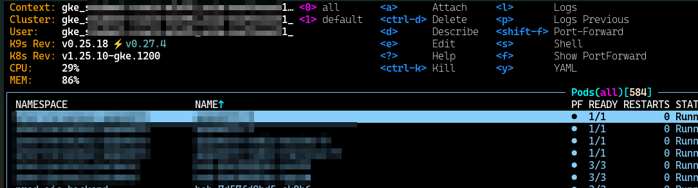
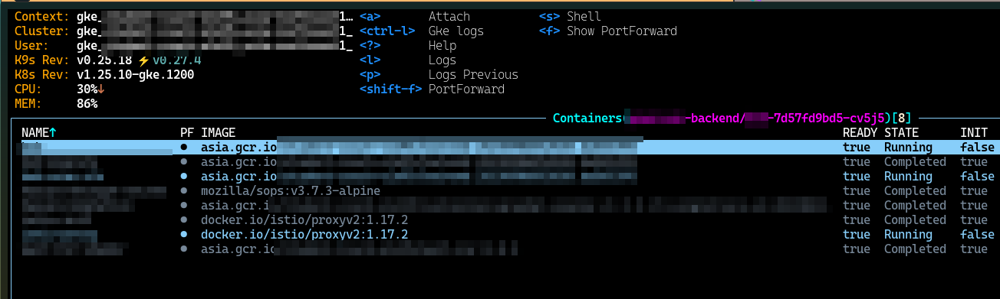
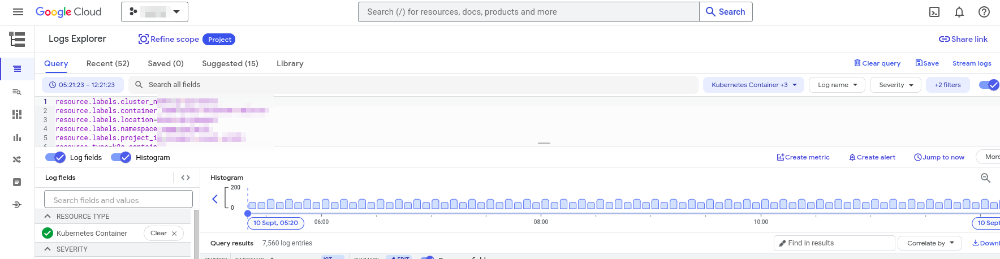

# gkel
gkel is a tool that allows you to open container logs from k9s to Google Cloud Logging. It is useful for debugging and monitoring your Kubernetes pods and share with other teams.

## Installation
To install gkel, you need to have the following prerequisites:

- [Golang](https://golang.org/)
- [k9s](https://k9scli.io/)

Then, follow these steps:

1. Clone this repository to your local machine.
2. Run `make install` in the project directory. This will build and install the gkel binary to your `$GOPATH/bin` directory.
3. Run `make get_abs_path_bin` to get the absolute path of the gkel binary.
4. Open the file `~/.k9s/plugins.yaml` or `~/.config/k9s/plugins.yaml` and add the following lines, replacing `<path>` with the absolute path of the gkel binary:


```yaml
  gkel: # open pod logs in Google Cloud Platform
    shortCut: Ctrl-L
    description: Gke logs
    scopes:
      - containers
    command: <path>
    background: true
    args:
      - -t
      - "k8s_container"
      - -g
      - "$CONTEXT"
      - -n
      - "$NAMESPACE"
      - -c
      - "$NAME"
```

## Usage
To use gkel, you need to have a Google Cloud Platform account and a project with logging enabled. You also need to have access to a Kubernetes cluster that is running on Google Kubernetes Engine (GKE).

To open container logs from k9s, follow these steps:

1. Launch k9s, switch to gke context and navigate to the all pods view by pressing `0`.
   
2. Select a pods then navigate to a container that you want to view its logs and press `Ctrl-L`. This will invoke gkel and open a new browser tab with the Google Cloud Logging interface.
   
3. You can filter, search, and analyze the logs using the Google Cloud Logging features.
   


## Contribution
If you want to contribute to this project, please follow these guidelines:
- Fork this repository and create a new branch for your feature or bugfix
- Write clear and concise commit messages and pull request descriptions
- Follow the code style and formatting conventions of the project
- Add tests and documentation for your changes
- Submit your pull request and wait for feedback

## License
gkel is licensed under the MIT License. See [LICENSE](LICENSE) for more details.